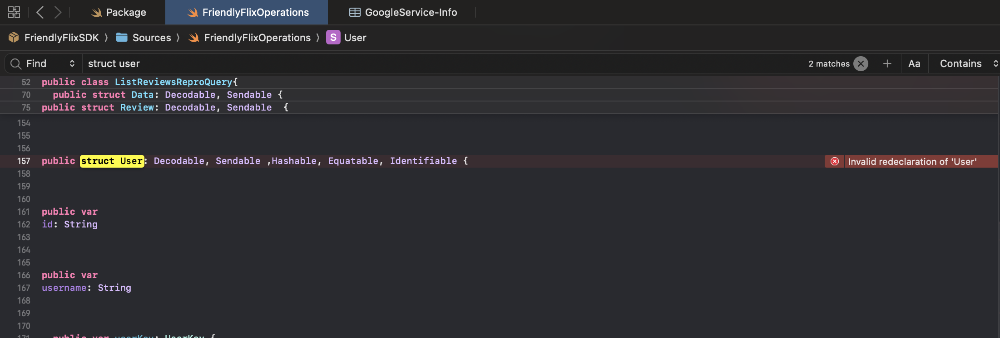
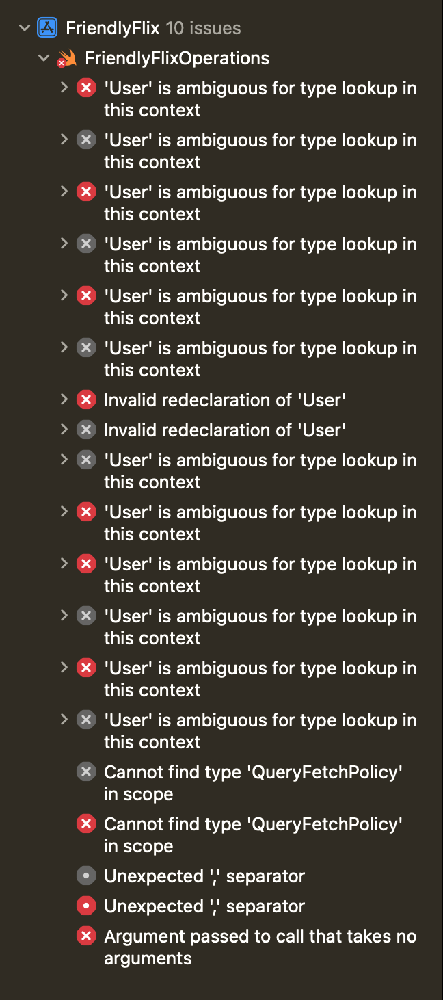

# Repro for issue 10341

## Versions

firebase-tools: v15.14.0

## Steps to reproduce

With this table in schema

```gql
type Review @table(name: "Reviews", key: ["movie", "user"]) {
  user: User!
  otherUser: User!
  # The user field adds the following foreign key field. Feel free to uncomment and customize it.
  #  userUid: String!
  movie: Movie!
  # The movie field adds the following foreign key field. Feel free to uncomment and customize it.
  #  movieId: UUID!
  rating: Int
  reviewText: String
  reviewDate: Date! @default(expr: "request.time")
}
```

and this query

```gql
query ListReviewsRepro @auth(level: PUBLIC) {
  reviews {
    rating
    reviewText
    user {
      id
      username
    }
    otherUser {
      id
      username
    }
  }
}
```

1. Run `firebase dataconnect:sdk:generate`
2. The generated SDK has an error
   

There are 2 `User` structs

- https://github.com/aalej/issues-10341/blob/406607aeb1af4939130cb946fe7b03746f38e400/app/FriendlyFlixSDK/Sources/FriendlyFlixOperations.swift#L412
- https://github.com/aalej/issues-10341/blob/406607aeb1af4939130cb946fe7b03746f38e400/app/FriendlyFlixSDK/Sources/FriendlyFlixOperations.swift#L478

## Notes

There seems to be other errors besides the duplicate `User` struct

- 
